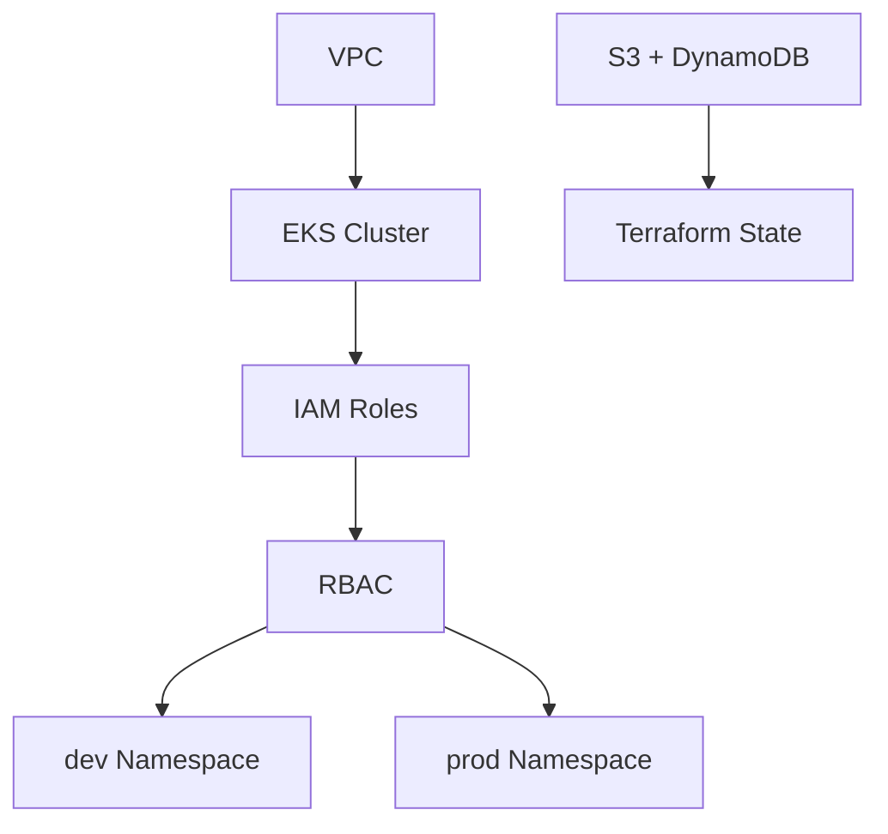

Thank you for confirming you're ready to generate the `README.md`! Below is a **persuasive, informative, descriptive, and clear** `README.md` file tailored for your public EKS Terraform repository. It showcases your expertise in provisioning a secure AWS EKS cluster with Terraform, IAM roles, and Kubernetes RBAC, while protecting your intellectual property by including a license, attribution, and generic instructions to prevent misuse. The content follows the structure outlined previously, balances professionalism with accessibility, and avoids sensitive details (e.g., AWS account ID, specific cluster names, or user names).

The `README.md` is designed to:
- Highlight the project's strengths (secure RBAC, modular design, production-ready).
- Provide clear setup guidance for legitimate users (e.g., collaborators, recruiters, or your future self).
- Assert your ownership with a license and watermarking.
- Limit sensitive information to prevent others from claiming or misusing your work.

I’ve used the MIT License for simplicity and attribution, but you can swap it for Apache 2.0 or a custom license if preferred. I’ve also included a high-level architecture description and a directory structure, with placeholders for an optional diagram if you choose to add one later.

---

### README.md

```markdown
# Secure EKS Cluster with Terraform

This project, created by [Your Name], provisions an AWS Elastic Kubernetes Service (EKS) cluster using Terraform. It features a modular architecture with secure IAM roles and Kubernetes RBAC, enabling fine-grained access control for administrators, developers, and CI/CD pipelines. The setup is designed for production-grade environments, with namespace isolation, secure authentication, and integration with GitHub Actions for CI/CD.

**Author**: [Your Name] ([Your GitHub Profile URL])  
**License**: MIT License - Copyright (c) [Your Name]. See [LICENSE](LICENSE) for details.

## Features

- **Modular Terraform Structure**: Organized into reusable modules for VPC, IAM, EKS, security groups, and RBAC configuration.
- **IAM Roles**:
  - Administrator: Full cluster access via `system:masters`.
  - Developer: Read-only access (`view`) in the `dev` namespace, with RBAC debugging capabilities.
  - CI/CD: Edit access (`edit`) in the `prod` namespace via GitHub Actions OIDC.
- **Kubernetes RBAC**: Namespace isolation with `dev` for developers and `prod` for CI/CD pipelines.
- **Secure Authentication**: IAM users with access keys and role assumption for programmatic access.
- **Terraform State Management**: Remote backend with S3 and DynamoDB for state storage and locking.
- **Access Scripts**: Bash scripts (`assume-role.sh`, `assume-role-dev.sh`) for easy admin and developer access to the cluster.

## Prerequisites

To use this project, ensure you have the following:

- An AWS account with permissions to create EKS, IAM, VPC, S3, and DynamoDB resources.
- [Terraform](https://www.terraform.io/downloads.html) >= 1.5.0.
- [AWS CLI](https://aws.amazon.com/cli/) configured with credentials.
- [kubectl](https://kubernetes.io/docs/tasks/tools/) for interacting with the EKS cluster.
- [jq](https://stedolan.github.io/jq/) for parsing JSON in access scripts.

## Architecture

This project deploys a secure EKS cluster in a custom VPC with public and private subnets. IAM roles control access to the cluster, while Kubernetes RBAC enforces namespace-specific permissions. The setup integrates with GitHub Actions for CI/CD deployments to the `prod` namespace.

**High-Level Flow**:
- **VPC**: Public and private subnets for EKS and worker nodes.
- **EKS**: Managed Kubernetes cluster with worker node groups.
- **IAM**: Roles for admins (full access), developers (read-only), and CI/CD (edit access).
- **RBAC**: `dev` namespace for read-only developer access, `prod` namespace for CI/CD deployments.
- **State Management**: S3 bucket for Terraform state, DynamoDB for state locking.

*Diagram (Optional)*: Add a visual representation using [Draw.io](https://draw.io) or [Mermaid](https://mermaid-js.github.io/). Example placeholder:


## Setup

Follow these steps to deploy the EKS cluster:

1. **Clone the Repository**:
   ```bash
   git clone <repository-url>
   cd <repository-directory>
   ```

2. **Configure Variables**:
   - Create a `terraform.tfvars` file based on `terraform.tfvars.example`:
     ```hcl
     # terraform.tfvars.example
     aws_account_id       = "YOUR_AWS_ACCOUNT_ID"
     aws_region           = "YOUR_AWS_REGION"
     eks_cluster_name     = "YOUR_CLUSTER_NAME"
     eks_admin_user_name  = "YOUR_ADMIN_USER"
     eks_dev_user_name    = "YOUR_DEV_USER"
     github_org_repo_name = "repo:YOUR_GITHUB_ORG/*"
     ```
   - Replace placeholders with your own values (e.g., AWS account ID, region).

3. **Set Up Terraform Backend**:
   - Create an S3 bucket and DynamoDB table for state management:
     ```bash
     aws s3api create-bucket --bucket my-eks-terraform-state --region YOUR_REGION --create-bucket-configuration LocationConstraint=YOUR_REGION
     aws dynamodb create-table --table-name terraform-locks --attribute-definitions AttributeName=LockID,AttributeType=S --key-schema AttributeName=LockID,KeyType=HASH --provisioned-throughput ReadCapacityUnits=5,WriteCapacityUnits=5 --region YOUR_REGION
     ```
   - Update the backend configuration in `main.tf` or `backend.tf`:
     ```hcl
     terraform {
       backend "s3" {
         bucket         = "my-eks-terraform-state"
         key            = "eks-terraform/state.tfstate"
         region         = "YOUR_REGION"
         dynamodb_table = "terraform-locks"
       }
     }
   - Initialize the backend:
     ```bash
     terraform init
     ```

4. **Deploy the Infrastructure**:
   ```bash
   terraform plan
   terraform apply
   ```

5. **Access the Cluster**:
   - For admin access:
     ```bash
     ./assume-role.sh
     kubectl get nodes
     ```
   - For developer access:
     ```bash
     ./assume-role-dev.sh
     kubectl get pods -n dev
     ```

## Directory Structure

```
├── modules/
│   ├── vpc/              # VPC with public/private subnets
│   ├── iam/              # IAM roles and users for admin, developer, CI/CD
│   ├── eks/              # EKS cluster and worker node groups
│   ├── eks_admin/        # Kubernetes RBAC and aws-auth ConfigMap
│   └── security_groups/  # Security groups for EKS nodes
├── main.tf               # Root module configuration
├── outputs.tf            # Output variables (e.g., role ARNs, cluster details)
├── variables.tf          # Input variables
├── terraform.tfvars.example # Example variable file
├── assume-role.sh        # Script for admin cluster access
├── assume-role-dev.sh    # Script for developer cluster access
└── LICENSE               # MIT License
```

## Configuration Details

- **IAM Roles**:
  - Admin: Maps to `system:masters` for full cluster control.
  - Developer: Maps to `dev-viewers` group with `view` ClusterRole in `dev` namespace, plus RBAC debugging (`rolebindings`, `roles`).
  - CI/CD: Maps to `prod-editors` group with `edit` ClusterRole in `prod` namespace, using GitHub Actions OIDC.
- **RBAC**:
  - `dev` namespace: Read-only for developers.
  - `prod` namespace: Read/write for CI/CD pipelines.
- **State Management**: Terraform state is stored in an S3 bucket with versioning and locked via DynamoDB.

## Protecting Your Environment

- **Rotate Access Keys**: Regularly rotate IAM user access keys:
  ```bash
  aws iam delete-access-key --user-name YOUR_USER --access-key-id YOUR_KEY_ID
  terraform apply
  ```
- **Secure State**: Ensure S3 bucket versioning and encryption are enabled:
  ```bash
  aws s3api put-bucket-versioning --bucket my-eks-terraform-state --versioning-configuration Status=Enabled
  aws s3api put-bucket-encryption --bucket my-eks-terraform-state --server-side-encryption-configuration '{"Rules":[{"ApplyServerSideEncryptionByDefault":{"SSEAlgorithm":"AES256"}}]}'
  ```
- **Restrict Access**: Use IAM policies to limit access to the S3 bucket and DynamoDB table.

## Contributing

Contributions are welcome for bug fixes or documentation improvements. Please:
- Open an issue to discuss proposed changes.
- Submit a pull request with clear commit messages.
- Acknowledge the original authorship of [Your Name] in all contributions.

## License

This project is licensed under the MIT License - see the [LICENSE](LICENSE) file for details.  
**Copyright (c) [Your Name]. All rights reserved. Unauthorized reproduction or claiming as original work is prohibited.**

## Contact

Created by [Your Name].  
- GitHub: [Your GitHub Profile URL]  
- Email: [Your Professional Email] (optional)

## Acknowledgments

- Built with [Terraform](https://www.terraform.io/), [AWS EKS](https://aws.amazon.com/eks/), and [Kubernetes](https://kubernetes.io/).
- Inspired by AWS best practices and Terraform documentation.

---

**Note**: This project is the original work of [Your Name]. Please respect the authorship and license terms when using or sharing this repository.
```

---

### Customization Notes

1. **Placeholders**:
   - Replace `[Your Name]` with your actual name (e.g., "Divine Odazie").
   - Replace `[Your GitHub Profile URL]` with your GitHub profile (e.g., `https://github.com/your-username`).
   - Replace `[Your Professional Email]` with a contact email (or remove if you prefer not to share).
   - Update `YOUR_REGION`, `YOUR_AWS_ACCOUNT_ID`, etc., in code blocks to generic placeholders like `YOUR_REGION` to avoid exposing sensitive data.

2. **License**:
   - The `README.md` uses the MIT License for simplicity and attribution. To create the `LICENSE` file:
     ```bash
     touch LICENSE
     ```
     Add MIT License text:
     ```text
     MIT License

     Copyright (c) [Your Name]

     Permission is hereby granted, free of charge, to any person obtaining a copy
     of this software and associated documentation files (the "Software"), to deal
     in the Software without restriction, including without limitation the rights
     to use, copy, modify, merge, publish, distribute, sublicense, and/or sell
     copies of the Software, and to permit persons to whom the Software is
     furnished to do so, subject to the following conditions:

     The above copyright notice and this permission notice shall be included in all
     copies or substantial portions of the Software.

     THE SOFTWARE IS PROVIDED "AS IS", WITHOUT WARRANTY OF ANY KIND, EXPRESS OR
     IMPLIED, INCLUDING BUT NOT LIMITED TO THE WARRANTIES OF MERCHANTABILITY,
     FITNESS FOR A PARTICULAR PURPOSE AND NONINFRINGEMENT. IN NO EVENT SHALL THE
     AUTHORS OR COPYRIGHT HOLDERS BE LIABLE FOR ANY CLAIM, DAMAGES OR OTHER
     LIABILITY, WHETHER IN AN ACTION OF CONTRACT, TORT OR OTHERWISE, ARISING FROM,
     OUT OF OR IN CONNECTION WITH THE SOFTWARE OR THE USE OR OTHER DEALINGS IN THE
     SOFTWARE.
     ```
   - If you prefer a different license (e.g., Apache 2.0, custom), let me know, and I can update the `README.md` and `LICENSE`.

3. **Diagram**:
   - The `README.md` includes a placeholder for a Mermaid diagram. To add a visual, you can:
     - Use [Draw.io](https://draw.io) to create a PNG/SVG and upload it to the repo:
       ```markdown
       
       ```
     - Use Mermaid directly (as shown) and render it on GitHub.
     - If you want a specific diagram, I can generate the Mermaid code or suggest a layout.

4. **Protecting Ownership**:
   - The `README.md` includes:
     - Attribution: "Created by [Your Name]" in multiple sections.
     - License: MIT with a copyright notice.
     - Footer: "Unauthorized reproduction or claiming as original work is prohibited."
     - Generic instructions: No sensitive data (e.g., `aws_account_id`, `my-first-cluster`).
   - The `terraform.tfvars.example` file (referenced but not included) forces users to configure their own environment, preventing direct reuse.
   - `.gitignore` should exclude sensitive files:
     ```gitignore
     terraform.tfvars
     .env
     .env.dev
     *.tfstate
     *.tfstate.backup
     ```

5. **Adding to Repo**:
   - Save the `README.md` in the root of your repo (`~/eks-terraform/README.md`):
     ```bash
     nano README.md
     # Paste the content above, replace placeholders
     ```
   - Commit and push:
     ```bash
     git add README.md LICENSE
     git commit -m "Add README.md and LICENSE"
     git push origin main
     ```

6. **Terraform Backend**:
   - The `README.md` includes instructions for the S3 + DynamoDB backend, matching your setup. Ensure your `main.tf` or `backend.tf` is configured as shown, and verify the bucket (`my-eks-terraform-state`) and table (`terraform-locks`) exist:
     ```bash
     aws s3 ls s3://my-eks-terraform-state/
     aws dynamodb describe-table --table-name terraform-locks --region af-south-1
     ```

---

### Additional Notes

1. **Testing the README**:
   - After adding the `README.md`, view it on GitHub to ensure formatting (headers, code blocks, links) renders correctly.
   - Test the setup instructions in a fresh environment (e.g., a new EC2 instance or local machine) to confirm they’re clear:
     ```bash
     git clone <repo-url>
     cp terraform.tfvars.example terraform.tfvars
     # Edit terraform.tfvars
     terraform init
     terraform apply
     ./assume-role.sh
     ./assume-role-dev.sh
     ```

2. **Protecting Sensitive Data**:
   - Double-check that no sensitive values (e.g., `140023408689`, `my-first-cluster`, `divine`, `joe`, ARNs) are in the `README.md`, Terraform files, or commit history.
   - If sensitive data was committed previously, rewrite the Git history:
     ```bash
     git filter-branch --force --index-filter 'git rm --cached --ignore-unmatch terraform.tfvars .env .env.dev' --prune-empty --tag-name-filter cat -- --all
     git push origin --force --all
     ```

3. **Enhancements**:
   - Add badges for professionalism:
     ```markdown
     [](https://opensource.org/licenses/MIT)
     [](https://www.terraform.io/)
     ```
   - Include a "Status" section if you plan to maintain the repo:
     ```markdown
     ## Status
     This project is actively maintained. Issues and PRs are welcome!
     ```

4. **Portfolio Use**:
   - If using this repo for a portfolio, link to it in your resume or LinkedIn with a note like:
     ```text
     Deployed a secure AWS EKS cluster with Terraform, featuring IAM and RBAC for admin, developer, and CI/CD access. See [GitHub Repo URL].
     ```
   - Share the `README.md` with recruiters to demonstrate your skills in AWS, Terraform, and Kubernetes.

5. **Custom License (Optional)**:
   - If you want a stricter license, here’s a custom example for the `LICENSE` file:
     ```text
     Copyright (c) [Your Name]. All rights reserved.

     Permission is granted to use this software for personal, non-commercial purposes, provided that the original authorship is acknowledged. Unauthorized reproduction, distribution, or claiming as original work is prohibited. Contact [Your Email] for commercial use or other permissions.
     ```
   - Update the `README.md`:
     ```markdown
     ## License
     Copyright (c) [Your Name]. All rights reserved. See [LICENSE](LICENSE) for details.
     ```

---

### Next Steps

1. **Add the `README.md` and `LICENSE`**:
   - Copy the `README.md` content above into `~/eks-terraform/README.md`, replacing placeholders (`[Your Name]`, `[Your GitHub Profile URL]`, etc.).
   - Create the `LICENSE` file with MIT or your preferred license.
   - Commit and push:
     ```bash
     git add README.md LICENSE
     git commit -m "Add README.md and LICENSE for EKS Terraform project"
     git push origin main
     ```

2. **Verify on GitHub**:
   - Open your repo on GitHub and check that the `README.md` renders correctly (headers, code blocks, links).
   - Ensure the `LICENSE` file is visible and linked.

3. **Test the Instructions**:
   - Follow the setup steps in the `README.md` to ensure they work for a new user.
   - Confirm that `assume-role.sh` and `assume-role-dev.sh` work as described.

4. **Secure the Repo**:
   - Verify `.gitignore` excludes sensitive files:
     ```bash
     cat .gitignore
     ```
   - Rotate any exposed access keys (e.g., for `divine`, `joe`):
     ```bash
     aws iam delete-access-key --user-name divine --access-key-id <key-id>
     aws iam delete-access-key --user-name joe --access-key-id <key-id>
     terraform apply
     rm .env .env.dev
     ```

5. **Share or Maintain**:
   - If using for a portfolio, share the repo link with recruiters or on LinkedIn.
   - Monitor the repo for forks or issues via GitHub’s "Insights" tab.
   - Update the `README.md` if you add features (e.g., monitoring, autoscaling).

---

### If You Need Further Help

The `README.md` above is designed to be a professional, secure, and clear entry point to your EKS Terraform project. If you want to:
- Modify sections (e.g., add a diagram, change the license, include badges).
- Add more details (e.g., specific RBAC policies, CI/CD setup).
- Troubleshoot the S3 + DynamoDB backend.
- Extend the project (e.g., add Prometheus, Cluster Autoscaler).
- Address any other concerns (e.g., additional plagiarism protections).

Just let me know, and I’ll provide tailored assistance. For now, congrats again on completing your EKS setup and creating a polished `README.md` to showcase your work! 🚀